# Power BI — Sales & Operations In Brazil Dashboard

- Increased sales by +22.9% YoY while maintaining profit growth (+21.5%).
- Identified that 86.8% of revenue is concentrated in SP, MG, RJ with different AOV patterns.
- Found that freight cost averages 15% of sales but exceeds 100% on some lanes (RO, MA, MT, RN).
- Detected a delivery bottleneck in March (lead-time 17 days) that reduced review scores.

---
## Data & Methodology
- **Dataset & Tools**:
    - Source: Brazilian e-commerce dataset (orders, customers, products, reviews, geolocation, freight).
    - Period: 2016–2018.
    - Tools: Power BI (Power Query, DAX)
- **Data modeling & preparation**:
    - Built a star schema: Dim_customers_dataset, Dim_geolocation_dataset, Dim_products_dataset, Dim_sellers_dataset, Dim_product_category_name_translation, Fact_orders_dataset, Fact_order_items_dataset, Fact_order_payments_dataset, Fact_order_reviews_dataset.
    - Cleaned and deduplicated orders (handled missing dates).
    - Engineered metrics: AOV, freight-to-sales %, review score distributions.
    - Used Pareto analysis (80/20), YoY growth, state-level segmentation, and delivery performance metrics.

## KPIs & Definitions  

| KPI          | Definition                         |
|-------------|-------------------------------------|
| Sales TY    | Total sales in current year (2018)  |
| Orders TY   | Number of orders in 2018            |
| AOV         | Sales / Orders                      |
| Freight %   | Freight cost / Sales                |
| Review Score| Average rating (1–5)                |
      

## Key insights
1. Sales pattern.
    - Year-end peak: Sales in November - December (Black Friday, Christmas) are significantly higher than the annual average, showing a strong seasonal spike.
    - **Implication**: Revenue is high dependent on Q4 performance, so missing this window creates a large downside risk.
    - **Suggestion**: 
        - **Marketing**: Launch targeted campaigns 4–6 weeks before peak season, focusing on top-selling categories and bundle promotions.
        - **Inventory & Supply Chain**: Increase stock levels of high-demand products and coordinate with suppliers to avoid stock-outs.
        - **Logistics**: Strengthen warehouse capacity and delivery speed to handle order surges.
        - **Finance**: Prepare flexible budget allocation for seasonal ads and temporary workforce.
        - **Customer Experience**: Offer faster delivery options or “gift-ready” packaging to improve conversion and satisfaction during holidays.  
        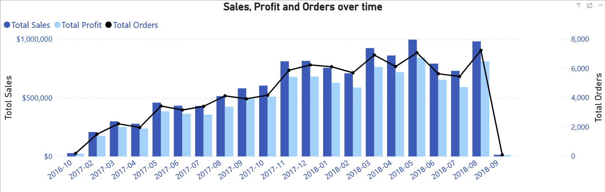
2. Sales growth analysis
    - Sale TY increased 22.91%, order TY increased 24.41%, Profits TY increased 21.46%, however AOV TY went down slightly 1.21%.
    - **Interpretation**:
        - Growth is mainly driven by higher order volume rather than larger baskets. This suggests a potential shift toward lower-priced products or smaller baskets, which I further investigate on the “Main market”.  
        ![Sale growth analysis]./Assets/(./Assets/image-1.png)
3. Main market: Brazil – Sao Paulo(SP), Minas Gerais (MG), Rio de Janeiro (RJ) in 2018.  
    - SP, MG, RJ together contribute about 86.8% of total sales (71.63%, 7.77%, and 7.4% respectively) making them the market score of business. Sao Paulo AOV is lower than the overall average 7% (124.07 vs 134.52), and its customer base grew strongly (+51%). 

    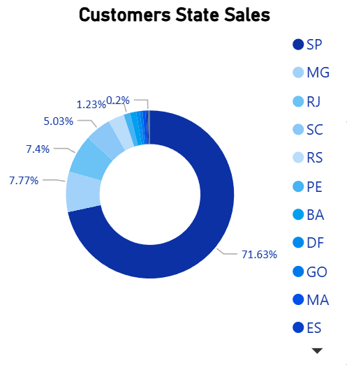
    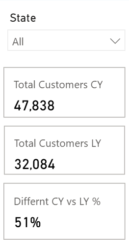

    - In contrast, MG stays almost the same at 135 and RJ have higher AOVs of 188 (Around 49.7%), while their customer base still grows fast (+35% and +71%). This indicates that growth in these two states is driven mainly by low order volume with relatively high ticket size. 

    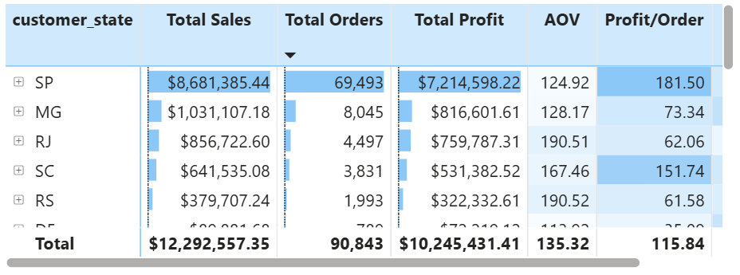
    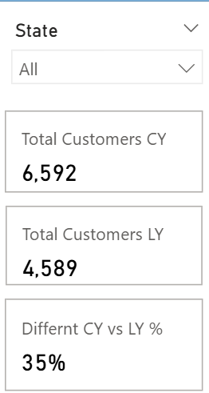
    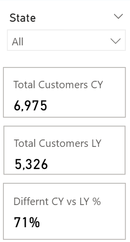

    - **Implication**: Revenue is highly concentrated in three states, and especially in SP. dependence on low value baskets creates margin risk if customer acquisition shows down or logistics cost rise. At the same time, the large and growing customer base in these states represents a strong opportunity to upgrade basket value.  
    - **suggestion**:   
        - **AOV uplift**: Cross-sell and bundle design for popular categories; set free-shipping thresholds to encourage larger baskets.  
        - **Product & pricing**: Tiered pricing and upselling higher margin SKUs (Limited editions, exclusive sets) instead of competing purely on low price.  
        - **Targeted marketing**: Personalized recommendations and loyalty rewards for higher spenders ("Complete your set" email flow) to convert frequent low-AOV buyers into higher value customers.  
        
        
4. Best selling category.
    - Using Pareto model to identify main leading categories. I found that Watches gifts, health-beauty, bed bath table, sports leisure, computers accessories, cool stuff accounted for 45% in total sales. However, from June to July 2018, total orders of **Sports Leisure** and **Watches Gifts** increased while total sales decreased, indicating customers are shifting to low-priced products and potential margin dilution.

    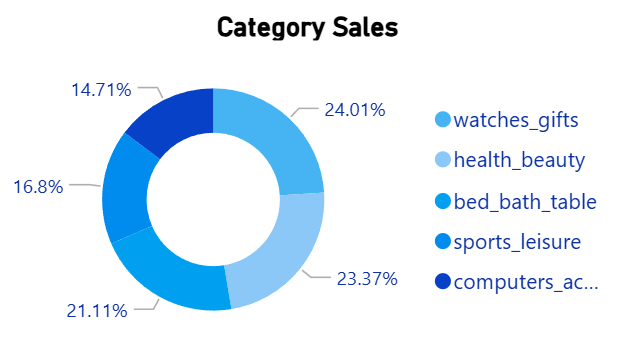
    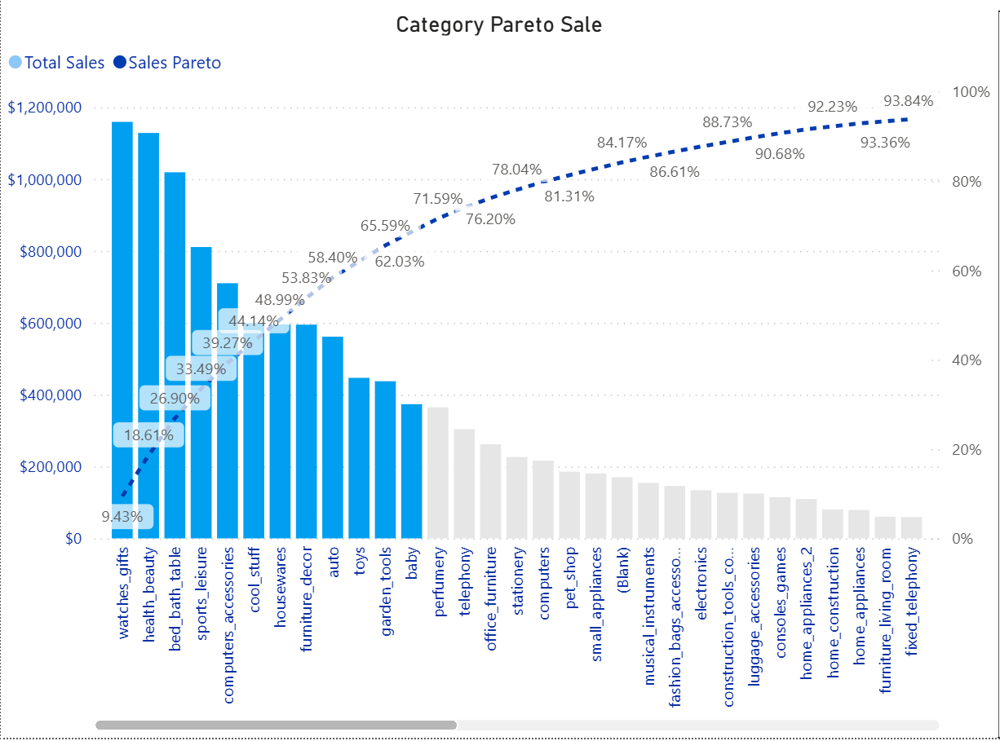

    - **Implication**: revenue growth in these categories is driven by volume rather than value, which may erode profitability if not controlled
    - **Suggestion**: Boost AOV through bundles and free-shipping thresholds, review low-margin SKUs, and run targeted promotions for mid-value products/high margin products instead of blanket discount.    

5. Freight cost vs Sales

    - Average freight cost is around 17% of sales, which is acceptable at the overall level. However, some remote states such as RO show a freight to sales ratio above 100%, mainly because order volume is very low while the freight charge is fixed by contract with the delivery partner. A few other states(MA, MT, RN) also exceed the average 7 - 15%, signaling potential inefficient on specific lanes.
    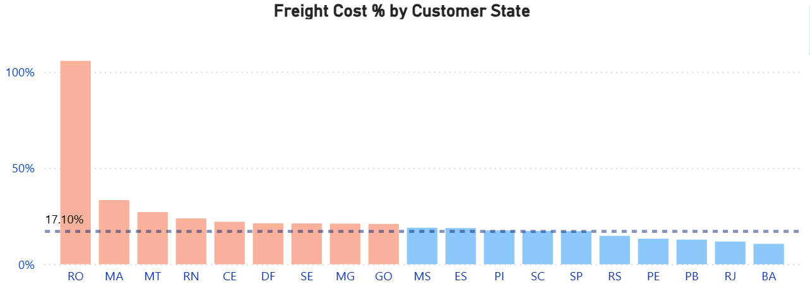

    - **Implication**: The current freight policy works at the aggregate level but hides structural losses on certain lanes. If these high-cost continue without adjustment, they can erode overall profitability even when national sales growth
    - **Suggestion**
        - **Lane-lvel-targets**: Set a target cap for freight to sale % by state (and key categories), and flag states that consistently exceed this threshold in the dashboard.
        - **Contract optimization**: Review and renegotiate contracts for high cost, low volume states (RO, MA, MT, RN). Consider switching to variable pricing, regional 3PLs, or close to the 15% benchmark.
        - **Commercial Levers**: Introduce higher free shipping thresholds or surcharges for remote areas, and promote bundles to increase basket size so that freight % more closer to the 15% benchmark.
        - **Portfolio review**: Reassess low-margin SKUs in structurally expensive states and focus on higher margin or smaller, lighter products that are more freight-efficient.
        - **Strategic coverage**: For lanes where sustainable economics connot be achieved, consider limiting service levels(longer lead times, fewer delivery options) or repositioning these states as secondary/experimental markets 

6. Customer feedback and delivery perfomace 

    - The average review score is 4.10, with 60.27% of orders receiving a rating above 4, and the average delivery time is 13 days
    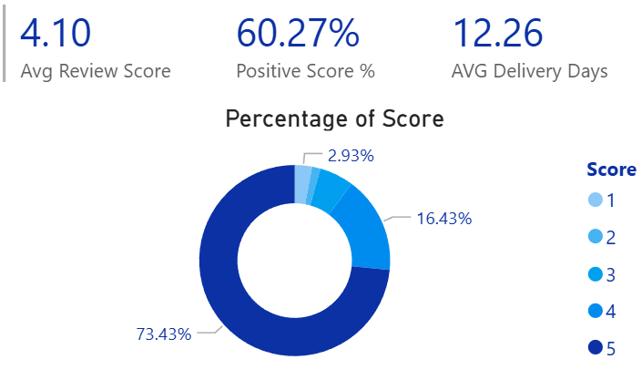
    - In March, the average review score drops to 4.04, while most other months are above 4.20.
    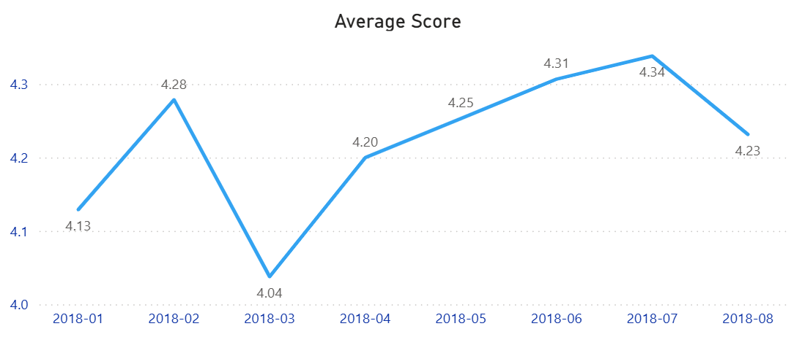
    - The main driver is a spike in delivery time to 17 days in March, which is about 5 days longer than the overall average.
    - March also records a significantly higher number of customers/orders, putting extra pressure on the delivery network. 
    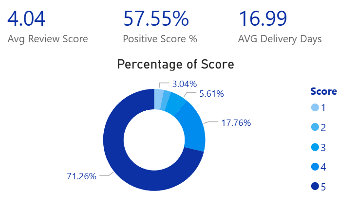
    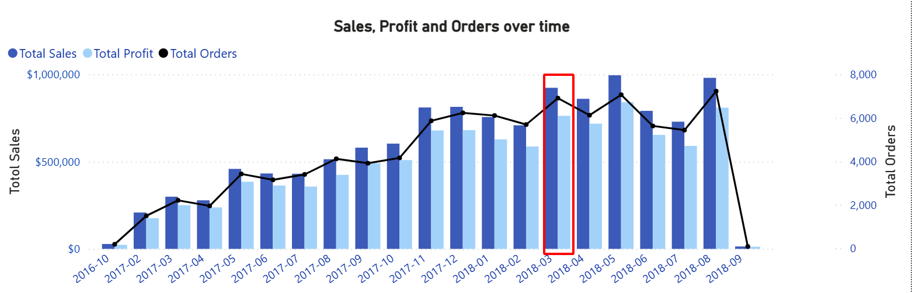
    - **Implication**: High demand in March overloaded our delivery capacity, leading to longer lead times and lower customer satisfaction. If this pattern repeats during future peak periods, it will limit retention and word-of-mouth growth even when sales are increasing. 
    - **Suggestion**:
        - **Capacity planning**: Treat March (and similar peaks) as a planned high-season. Secure additional logistics capacity and temporary staff in advance.
        - **Service-level management**: Adjust SLA promises during peak months (clear ETA communication, longer but realistic delivery windows) to manage expectations.
        - **Process optimization**: Prioritize shipments with higher promise gaps and high-value customers, and monitor daily backlog vs capacity in the operations dashboard.
        - **Customer communication**: Proactively notify customers about delays and offer small compensation (vouchers, free shipping on next order) when delivery time exceeds a defined threshold.

## Business impact & next steps

- If the recommended actions are implemented (AOV uplift in RJ/MG and better capacity planning in March), we estimate an increase of around **3% in annual sales**.  
- By optimizing freight costs for RO, MT, MA and RN, we estimate a **1 percentage point reduction in the overall freight-to-sales ratio**.  
- If the company improves warehouse capacity management, designs effective cross-sell and bundle offers, and implements a loyalty program to drive upsell, we estimate a **total uplift of around 7% in sales** and an additional **2–3 percentage point reduction in the freight-to-sales ratio**.

> These estimates are based on simplified scenario modelling and are intended to illustrate potential business impact rather than provide a precise financial forecast.

## Overview Dashboard
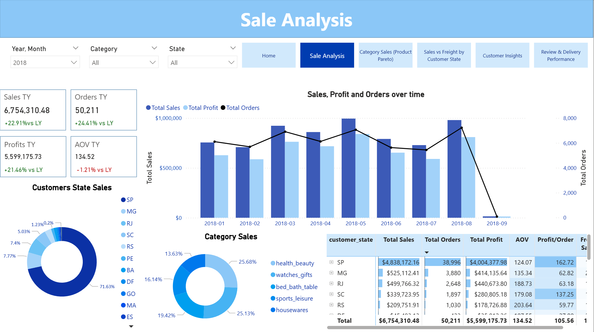
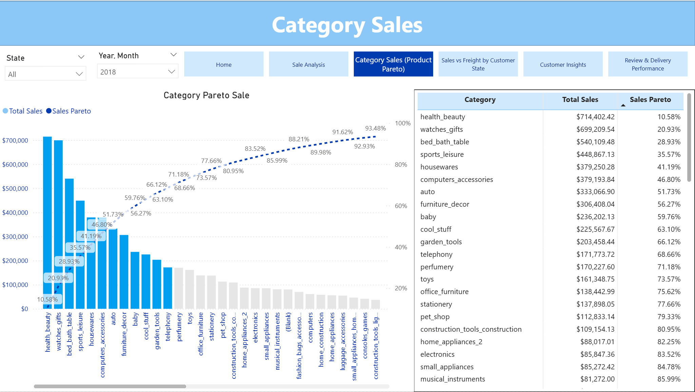
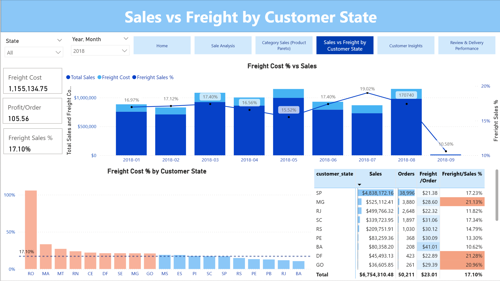
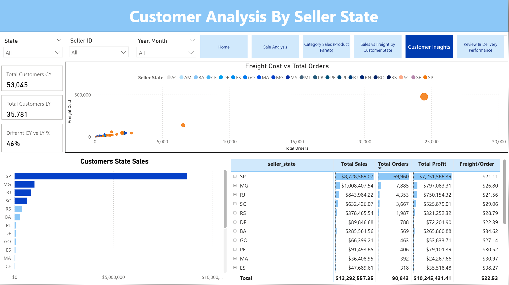
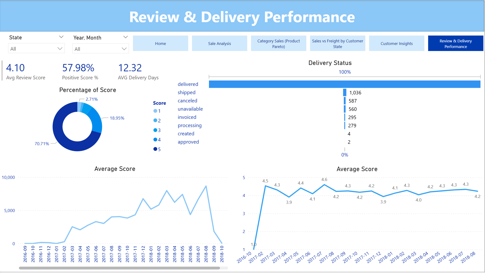